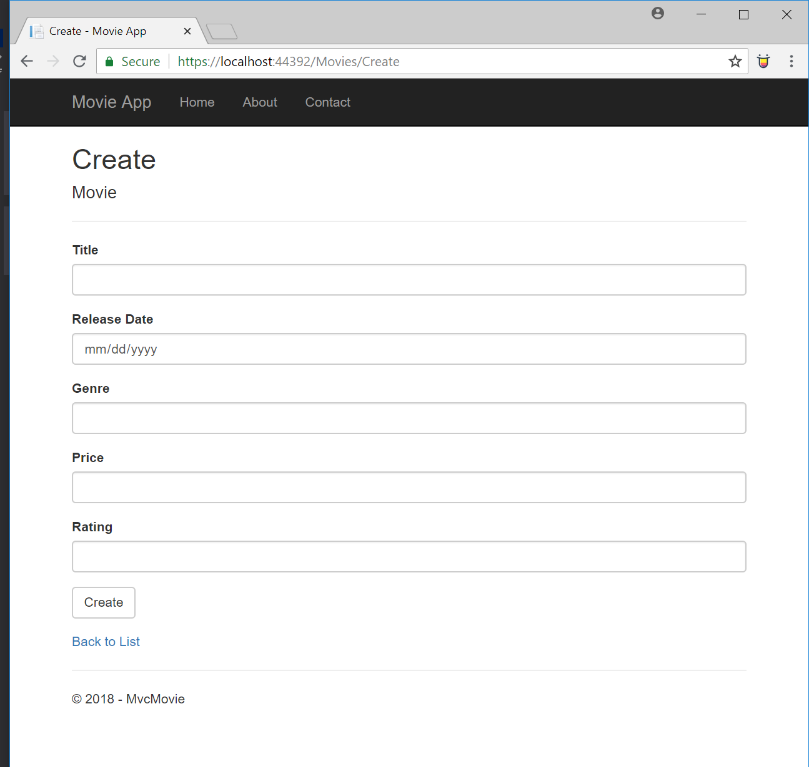

# Lab12_MVC_Movie
An MVC application using .NET Framework. Created by following the [Microsoft tutorial](https://docs.microsoft.com/en-us/aspnet/core/tutorials/first-mvc-app/start-mvc?tabs=aspnetcore2x&view=aspnetcore-2.1)
It is a movie application where users can enter movie information. The entered data can be stored
in a SQL lite database. User is then able to do CRUD operations on the data. Search functionality 
has also been implemented

## What you need
* Install the latest Visual Studio 2017
* Have Windows OS on your device

## How to Open App
* Fork the Lab12_MVC_Movie repo from [my GitHub Page](https://github.com/Calamario)
* Git Clone the repo onto your local device
* Open .sln file with Visual Studio
* Click on the green arrow to start
* Upon starting, it will open a web page using local host.

## Special Thanks
IMicrosoft tutorial

## What it looks like
